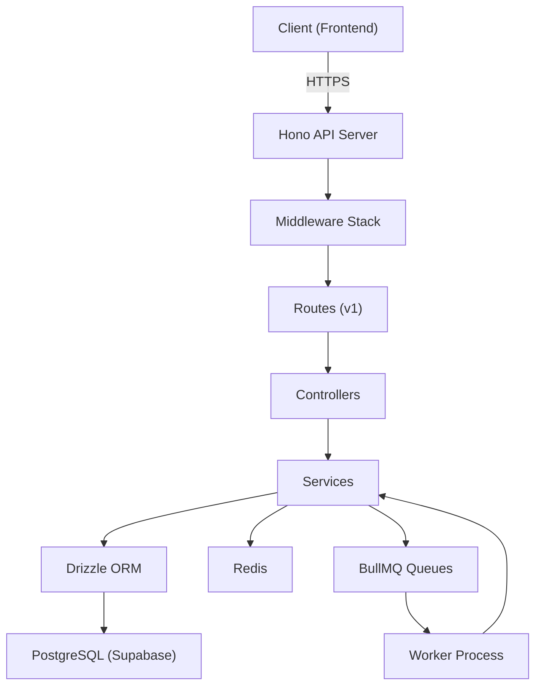

# J2M Backend — Implementation Walkthrough

## Summary

The **Journey to Mastery** backend is fully implemented — a production-grade REST API built with **Hono + TypeScript + Drizzle ORM + PostgreSQL + Redis + BullMQ**. All 8 implementation phases are complete.

> [!IMPORTANT]
> **Verification**: TypeScript compiles with zero errors. All 46 unit tests pass across 5 test suites.

---

## Architecture



### Request Flow
```
Request → RequestID → SecureHeaders → CORS → RateLimit → Logging → Route → Auth → Role → Validate → Controller → Service → DB/Redis
```

---

## File Tree

```
src/
├── app.ts                          # Hono app with global middleware
├── server.ts                       # Node server entry point
├── config/
│   ├── env.ts                      # Zod-validated environment
│   ├── db.ts                       # PostgreSQL connection (Supabase pooler)
│   ├── redis.ts                    # ioredis client (BullMQ-compatible)
│   ├── queue.ts                    # BullMQ queue definitions
│   ├── logger.ts                   # Pino structured logger
│   └── github.ts                   # GitHub OAuth config
├── db/
│   ├── schema.ts                   # 10 Drizzle tables + relations
│   ├── client.ts                   # Drizzle client instance
│   ├── views.sql                   # Leaderboard materialized view
│   └── migrations/                 # Auto-generated SQL migrations
├── middleware/
│   ├── auth.middleware.ts          # JWT verification + blacklist
│   ├── role.middleware.ts          # requireRole(['admin']) factory
│   ├── validate.middleware.ts      # Zod validation wrapper
│   ├── errorHandler.middleware.ts  # Centralized error → envelope
│   ├── requestId.middleware.ts     # X-Request-ID tracing
│   └── rateLimit.middleware.ts     # Redis sliding-window rate limiter
├── routes/v1/
│   ├── index.ts                    # V1 router mounting all groups
│   ├── health.routes.ts            # GET /health (DB + Redis check)
│   ├── auth.routes.ts              # GitHub OAuth + JWT management
│   ├── user.routes.ts              # User dashboard/tasks/submissions
│   ├── judge.routes.ts             # Judge review queue + workload
│   ├── admin.routes.ts             # Full admin management
│   ├── leaderboard.routes.ts       # Global leaderboard
│   ├── post.routes.ts              # Community posts (read)
│   ├── notification.routes.ts      # User notifications
│   └── comment.routes.ts           # Submission comments
├── controllers/
│   ├── auth.controller.ts
│   ├── user.controller.ts
│   ├── judge.controller.ts
│   ├── admin.controller.ts
│   └── leaderboard.controller.ts
├── services/
│   ├── auth.service.ts             # GitHub OAuth + JWT issuance
│   ├── user.service.ts             # Dashboard/tasks/submissions/profile
│   ├── judge.service.ts            # Review queue + edit window
│   ├── admin.service.ts            # Full admin operations + audit
│   ├── assignment.service.ts       # Auto-assignment algorithm
│   ├── github.service.ts           # GitHub repo fetching + cache
│   └── leaderboard.service.ts      # Materialized view + cache
├── validators/
│   ├── auth.validator.ts
│   ├── user.validator.ts
│   ├── judge.validator.ts
│   └── admin.validator.ts
├── jobs/
│   ├── assignJudge.job.ts          # Judge auto-assignment processor
│   ├── leaderboardRecalculate.job.ts
│   ├── repoPrefetch.job.ts
│   ├── notificationDispatch.job.ts
│   └── workers/index.ts            # BullMQ worker process entry
├── utils/
│   ├── apiResponse.ts              # success/created/accepted/error envelope
│   ├── apiError.ts                 # AppError + factory functions
│   ├── constants.ts                # Roles, ranks, statuses, cache keys
│   ├── encryption.ts               # AES-256-GCM for GitHub tokens
│   └── pagination.ts               # Cursor pagination helpers
├── types/
│   └── index.ts                    # AppEnv, AuthUser, JWTPayload types
└── tests/unit/
    ├── apiError.test.ts            # 8 tests
    ├── constants.test.ts           # 10 tests
    ├── encryption.test.ts          # 7 tests
    ├── errorHandler.test.ts        # 4 tests
    └── validators.test.ts          # 17 tests
```

---

## Endpoint Summary (~46 endpoints)

### Auth (`/api/v1/auth`)
| Method | Path | Auth | Description |
|--------|------|------|-------------|
| GET | `/github` | Public | Redirect to GitHub OAuth |
| GET | `/github/callback` | Public | Exchange code → JWT |
| POST | `/refresh` | Public | Rotate JWT tokens |
| GET | `/me` | Bearer | Current user profile |
| POST | `/logout` | Bearer | Blacklist current JWT |
| GET | `/profile-status` | Bearer | Check profile completion |
| POST | `/complete-profile` | Bearer | One-time profile setup (409 guard) |

### User (`/api/v1/user`)
| Method | Path | Auth | Description |
|--------|------|------|-------------|
| GET | `/dashboard` | user/admin | Dashboard summary |
| GET | `/tasks` | user/admin | Available tasks (filterable) |
| GET | `/tasks/:id` | user/admin | Task detail |
| GET | `/tasks/completed` | user/admin | Completed tasks |
| GET | `/tasks/pending` | user/admin | Pending tasks |
| GET | `/github/repos` | user/admin | GitHub repos (cached) |
| POST | `/submissions` | user/admin | Submit task → auto-assign |
| GET | `/submissions` | user/admin | Own submissions |
| GET | `/submissions/:id` | user/admin | Submission detail |
| PATCH | `/submissions/:id` | user/admin | Edit pending submission |
| DELETE | `/submissions/:id` | user/admin | Withdraw pending submission |
| GET | `/profile` | user/admin | Own profile |
| PATCH | `/profile` | user/admin | Update profile |

### Judge (`/api/v1/judge`)
| Method | Path | Auth | Description |
|--------|------|------|-------------|
| GET | `/dashboard` | judge/admin | Judge dashboard |
| GET | `/submissions` | judge/admin | Assigned queue |
| GET | `/submissions/:id` | judge/admin | Submission for review |
| POST | `/submissions/:id/review` | judge/admin | Submit review |
| GET | `/reviews` | judge/admin | Own review history |
| GET | `/reviews/:id` | judge/admin | Review detail |
| PATCH | `/reviews/:id` | judge/admin | Edit review (24h window) |
| GET | `/criteria` | judge/admin | Scoring rubric |
| GET | `/workload` | judge/admin | Own load score |

### Admin (`/api/v1/admin`)
| Method | Path | Auth | Description |
|--------|------|------|-------------|
| GET | `/dashboard` | admin | Platform analytics |
| GET | `/dashboard/activity` | admin | Activity feed |
| GET/PATCH/DELETE | `/users/:id` | admin | User management |
| PATCH | `/users/:id/role` | admin | Change user role |
| POST/GET | `/tasks` | admin | Task CRUD |
| PATCH/DELETE | `/tasks/:id` | admin | Task management |
| GET | `/submissions` | admin | All submissions |
| POST | `/submissions/:id/assign` | admin | Manual judge assign |
| GET | `/assignment/unassigned` | admin | Unassigned queue |
| POST | `/assignment/reassign/:id` | admin | Re-assign submission |
| PATCH | `/reviews/:id/override` | admin | Override review |
| POST | `/leaderboard/recalculate` | admin | Force refresh (202) |
| GET | `/judges` | admin | Judges + workload |
| POST/GET | `/posts` | admin | Post CRUD |
| PATCH/DELETE | `/posts/:id` | admin | Post management |
| GET | `/audit-log` | admin | Full audit trail |

### Public (authenticated)
| Method | Path | Auth | Description |
|--------|------|------|-------------|
| GET | `/leaderboard` | any | Global leaderboard |
| GET | `/posts` | any | Community posts feed |
| GET | `/posts/:id` | any | Post detail |
| GET | `/notifications` | any | Own notifications |
| PATCH | `/notifications/:id/read` | any | Mark read |
| PATCH | `/notifications/read-all` | any | Mark all read |
| DELETE | `/notifications/:id` | any | Delete notification |
| GET | `/submissions/:id/comments` | any* | Comment thread |
| POST | `/submissions/:id/comments` | any* | Add comment |

---

## Key Design Decisions

### Judge Auto-Assignment Algorithm
```
loadScore = pendingCount + (avgTurnaroundHrs / 24)
```
- Self-review guard: judge ≠ submission author
- Overload threshold: configurable (default 15)
- Tie-break: round-robin (last-assigned-longest-ago)
- Runs async via BullMQ (non-blocking API response)

### Security
- JWT access tokens (15m) + refresh tokens (7d) with rotation
- Token blacklisting via Redis (logout/revocation)
- GitHub tokens encrypted with AES-256-GCM before storage
- CORS, secure headers, Redis-backed rate limiting

### Performance
- Cursor-based pagination (no offset/limit drift)
- Materialized view for leaderboard (refreshed via BullMQ job)
- Redis caching for repos (2-5min), leaderboard (30-60s)
- BullMQ workers run as separate process from API server

---

## Verification Results

| Check | Result |
|-------|--------|
| TypeScript (`tsc --noEmit`) | ✅ Zero errors |
| Unit tests (46 tests, 5 suites) | ✅ All passing |
| Drizzle migration generated | ✅ `0000_elite_sentinels.sql` |
| Rate limiting middleware | ✅ Redis sliding window |

---

## Next Steps (to deploy)

1. **Set up Supabase project** → get `DATABASE_URL` (pooler, port 6543)
2. **Run migrations**: `npm run db:push` or `npm run db:migrate`
3. **Create materialized view**: Execute `src/db/views.sql` manually
4. **Configure GitHub OAuth App** → set `GITHUB_CLIENT_ID/SECRET`
5. **Start services**: `npm run dev` (API) + `npm run worker:dev` (BullMQ)
6. **Set up Redis** (local via `docker-compose up redis` or cloud)
